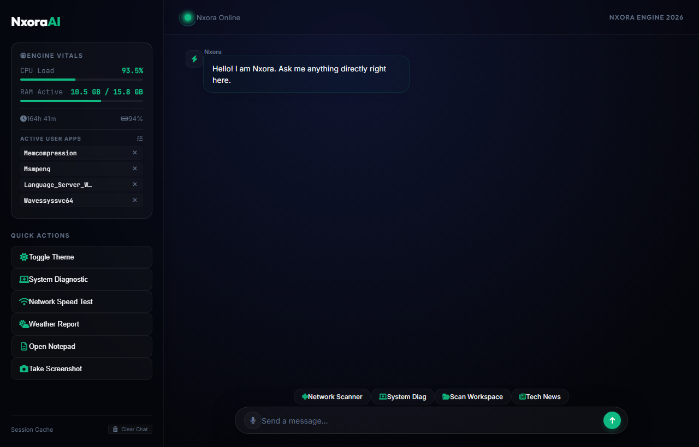
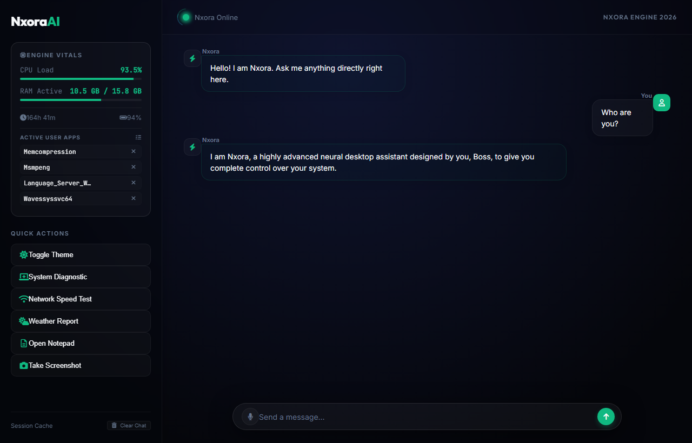
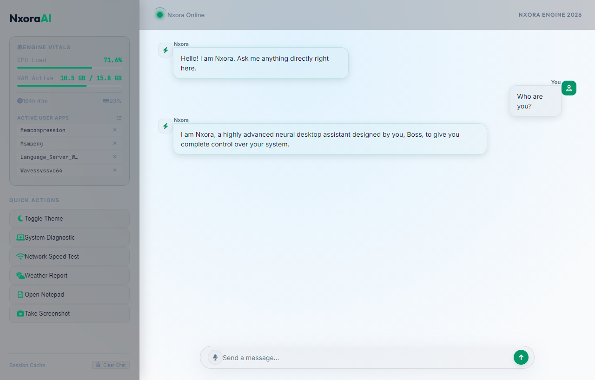

# Nxora AI - Desktop Assistant

Nxora is a sophisticated, highly capable artificial intelligence local desktop assistant running exclusively on Windows. Built using a PyQt5/WebEngine frontend and a threaded Python backend, it integrates seamlessly with your local operating system and is capable of running both local edge AI models and cloud-based models (via Gemini).

## 🚀 Key Features

- **Offline CPU Model Engine**: Automatically downloads and runs local GGUF models (e.g., SmolLM, Qwen, Phi-3) using your PC's CPU for privacy and performance. Fallbacks to Google Gemini if an online API key is supplied.
- **System Intelligence & Control**: Locks your PC, toggles Dark/Light mode, empties the recycle bin, checks PC components (CPU/RAM disk space), clears temporary files, takes screenshots, changes brightness or volume, etc.
- **Live Internet Scraping**: Real-time Cricket score streaming (World Cup/IPL), weather reporting, and search summarizations via DuckDuckGo and Wikipedia.
- **Automated Web Driving**: Built-in support to open popular sites smoothly, search for topics, and auto-play music tracks on YouTube.
- **Vision & File Analysis**: Uses **Tesseract-OCR** to read text directly from your screen and can read & analyze local `.pdf` files.
- **Mobile Bridge API (`api/api.py`)**: Includes a lightweight Flask Backend that enables mobile devices to connect over your local network using WebSockets and the Porcupine wake-word engine.
- **Built-in Voice Interaction**: Hands-free voice recognition and Wake Word integration.

---

## 🛠️ Requirements & Prerequisites

1. **Python 3.8+**
2. **OS**: Windows 10 or 11
3. **Tesseract-OCR**: Required for the *Screen Vision* capability.
    - Download the windows installer from the [UB-Mannheim repository](https://github.com/UB-Mannheim/tesseract/wiki) and install it to the default path (`C:\Program Files\Tesseract-OCR\`).

---

## 💻 Installation

1. **Clone or Extract the Repository:**
   Navigate into the project directory.
   ```bash
   cd Nxora
   ```

2. **Create a Python Virtual Environment:**
   ```bash
   python -m venv venv
   ```

3. **Activate the Virtual Environment:**
   - **Command Prompt**: `venv\Scripts\activate.bat`
   - **PowerShell**: `venv\Scripts\Activate.ps1`

4. **Install Dependencies:**
   ```bash
   pip install -r requirements.txt
   ```

5. **Environment Configuration:**
   - Create a `.env` file in the root directory.
   - For cloud fallback/vision API functionality, add your Google Gemini API key:
     ```env
     GEMINI_API_KEY=your_gemini_api_key_here
     ```

---

## 🎯 How to Run

### Start the Desktop Assistant
To launch the beautiful, rich graphical UI, simply run:
```bash
python main.py
```
*(Optionally you can just click your start script or `py main.py` in the activated virtual environment).* 

### Start the Mobile API Backend
If you want to spin up the independent Flask app API to allow your phone to communicate with the PC's brain:
```bash
python api/api.py
```
*Make sure your PC and mobile device are on the same Wi-Fi network.*

---

## 🎙️ Command Examples (How to Use)

You can write or say commands to Nxora! Here are a few capabilities:

### PC Control & Automation
- `"Check storage"` or `"How much CPU and RAM are you using?"`
- `"Empty the trash"` or `"Clear temp files"`
- `"Set brightness to 80"` or `"Mute my microphone"`
- `"Take a screenshot"` or `"Put the PC to sleep"`
- `"Kill all Chrome processes"`

### Advanced AI Tools
- `"Read my screen"` (Captures active screen text and summarizes it).
- `"Summarize pdf absolute/path/to/file.pdf"`
- `"Read my clipboard"` or `"Summarize my clipboard"`
- `"Create a file"` -> Prompts for filename and topics and writes actual visual code into Notepad for you.
- `"Calculate 52 * 8 / 2"`

### Web Integration
- `"Play [song name] on YouTube"`
- `"Who is [person]"` or `"Tell me about [topic]"`
- `"What is the weather today?"`
- `"Live cricket score"` (Starts the Background live scraper thread)
- `"Create a Holi website"` (Generates a dynamic, colorful, interactive festival greeting page entirely offline).

---

## 📷 App Preview & Screenshots

Here is a preview of the Nxora AI desktop assistant in action:

### 1. Standby Screen (Dark Mode)
*Showing the cinematic glass dark theme, sidebar, quick action shortcuts, and system engine vitals.*



### 2. AI Model Response (Dark Mode)
*Showing the user's conversational query and the model's intelligent response.*



### 3. Light Theme
*Showing the alternative clean Light theme.*



---

## 🗃 File Architecture
- `main.py` - Core entry point. Initializes databases, audio channels, and the PyQt5 GUI.
- `model_engine.py` - Handles dynamic routing between local GGUF models, HuggingFace fallback, and the Gemini API.
- `core/` - The central scripts logic (`engine.py` logic, `cricket_scraper.py`, `database.py`, `audio.py`).
- `ui/` - The HTML/CSS/JS frontend files running inside the WebEngine renderer.
- `api/` - Mobile bridging scripts and REST endpoints.
- `Screenshots/` - Visual previews of the application in action.
